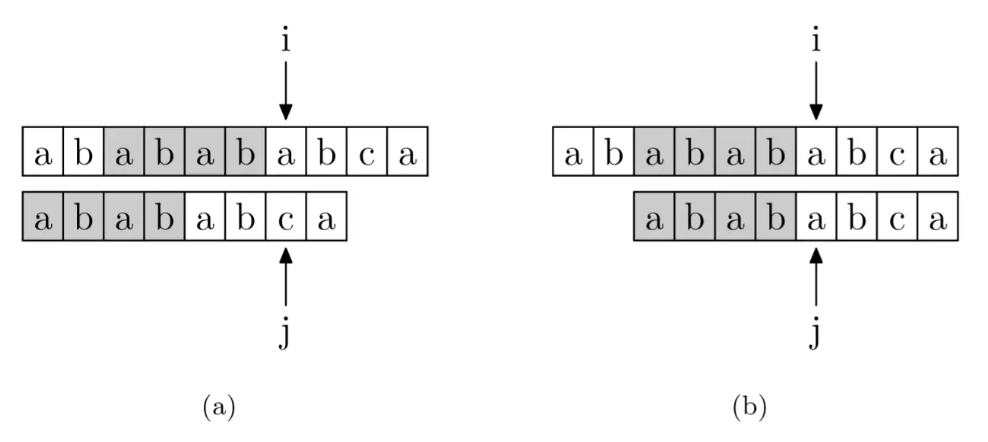
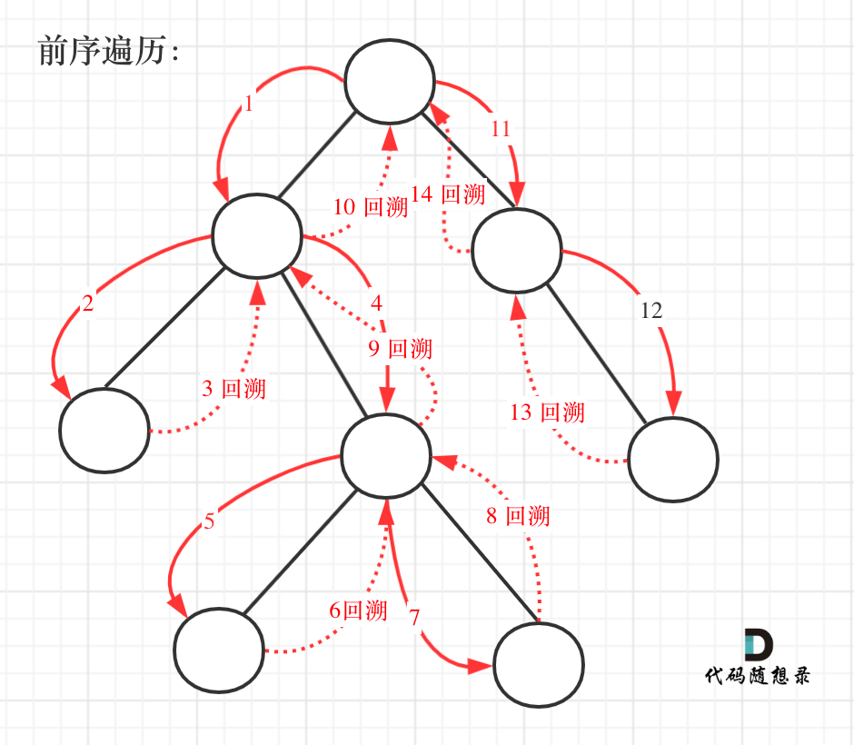

# 代码随想录学习笔记

## 数组

### 二分查找
>给定一个`n`个元素有序的（升序）整型数组`nums`和一个目标值`target`，写一个函数搜索`nums`中的`target`，如果目标值存在返回下标，否则返回`-1`。

[二分查找](https://leetcode.cn/problems/binary-search/description/)

#### 二分查找的使用思路
二分查找的使用前提首先是数组为**有序数组**，以及其中**没有重复元素**。因为一旦存在重复元素，使用二分查找后返回的下标可能不是唯一的。

#### 二分查找的第一种写法
定义target在一个左闭右闭的区间中，即[left,right]，所以：
- while (left <= right) 要使用 <= ，因为left == right是有意义的，所以使用 <=
- if (nums[middle] > target) right 要赋值为 middle - 1，因为当前这个nums[middle]一定不是target，那么接下来要查找的左区间结束下标位置就是 middle - 1

#### 二分查找的第二种写法
定义target在一个左闭右开的区间中，即[left,right)，则：
- while (left < right)，这里使用 < ,因为left == right在区间[left, right)是没有意义的
- if (nums[middle] > target) right 更新为 middle，因为当前nums[middle]不等于target，去左区间继续寻找，而寻找区间是左闭右开区间，所以right更新为middle，即：下一个查询区间不会去比较nums[middle]
```C++
int middle = left + ((right - left) / 2);//一般这样写可以防止溢出
if (nums[middle] > target) {
    right = middle; // target 在左区间，在[left, middle)中
    } else if (nums[middle] < target) {
    left = middle + 1; // target 在右区间，在[middle + 1, right)中
    }
```

### 长度最小的子数组
>给定一个含有`n`个正整数的数组和一个正整数`target`。  
找出该数组中满足其总和大于等于`target`的长度最小的子数组`[nums_l, nums_l+1, ..., nums_r-1, nums_r]`，并返回其长度。如果不存在符合条件的子数组，返回`0`。

[长度最小的子数组](https://leetcode.cn/problems/minimum-size-subarray-sum/description/)

#### 滑动窗口
所谓滑动窗口，就是**不断的调节子序列的起始位置和终止位置，从而得出我们要想的结果**。

- 窗口内是什么？
  窗口就是满足**其和 ≥ s**的长度最小的连续子数组。
- 如何移动窗口的起始位置？
  窗口的起始位置如何移动：如果当前窗口的值大于等于s了，窗口就要向前移动了（也就是该缩小了）。
- 如何移动窗口的终止位置？
  窗口的结束位置如何移动：窗口的结束位置就是遍历数组的指针，也就是for循环里的索引。
```C++
while(sum >= s){
    subLength = (j - i + 1);
    result = result < subLength ? result : subLength;
    sum -= nums[i++];
}
```

## 链表

### 环形链表Ⅱ
>题目：给定一个链表，返回链表开始入环的第一个节点。 如果链表无环，则返回`null`。  
为了表示给定链表中的环，使用整数`pos`来表示链表尾连接到链表中的位置（索引从 0 开始）。 如果`pos`是 -1，则在该链表中没有环。
说明：不允许修改给定的链表。

[环形链表Ⅱ](https://leetcode.cn/problems/linked-list-cycle-ii/description/)

#### 判断链表中是否有环
快慢指针法：分别定义`fast`和`slow`指针，从头结点出发，`fast`指针每次移动两个节点，`slow`指针每次移动一个节点，**如果`fast`和`slow`指针在途中相遇 ，说明这个链表有环**。

#### 找到环的入口
有环的话快慢指针一定在环内相遇。现在设置另一个以头结点为起点的慢指针，以及之前的慢指针，让他们俩一起走“快慢指针相遇时慢指针走过的距离”。这样，旧慢指针走了原来两倍的路程，即快指针的路程，那么它会停在快指针停的地方。而新慢指针，它以相同的速度走了旧慢指针原本走过的路，也会停在原来快慢指针相遇的地方。这时候三个指针相遇。对于**两个慢指针，他们速度相同，又能在环内相遇，那么往前倒推，他们一定在环内一直相遇，直到退回至他们在环的入口处第一次相遇**，再退回时新慢指针即将第一次入环。所以两个慢指针第一次相遇时就是在环的入口处。


## 字符串

### 实现字符串内查找模型字符串（KMP算法）
>给你两个字符串`haystack`和`needle`，请你在`haystack`字符串中找出`needle`字符串的第一个匹配项的下标（下标从 0 开始）。如果`needle`不是`haystack`的一部分，则返回-1 。

[KMP算法](https://leetcode.cn/problems/find-the-index-of-the-first-occurrence-in-a-string/description/)

#### PMT（部分匹配表）
对于任意长度的字符串，都有数个前缀集合和后缀集合，**PMT中的值是字符串的前缀集合与后缀集合的交集中最长元素的长度**。
>如：对于‘aba’，它的前缀集合为{‘a’, ‘b’}，后缀 集合为{‘ba’, ‘a’}。两个集合的交集为{‘a’}，那么长度最长的元素就是字符串‘a’了，长度为1，所以对于‘aba’而言，它在PMT表中对应的值就是1。对于字符串‘ababa’，它的前缀集合为{‘a’, ‘ab’, ‘aba’, ‘abab’}，它的后缀集合为{‘baba’, ‘aba’, ‘ba’, ‘a’}，两个集合的交集为{‘a’, ‘aba’}，其中最长的元素为‘aba’，长度为3。

#### PMT对于字符串查找的帮助
主字符串中 i 指针之前的 PMT[j−1]位就一定与模式字符串的第0位至第PMT[j−1]位是相同的。这是因为主字符串在i位失配，也就意味着主字符串从 i−j 到 i 这一段是与模式字符串的 0 到 j 这一段是完全相同的。


>如图所示，在字符串“ababab”中，最大相等前后缀为‘abab’，故对应的PMT值即为4。当 j 指针移动到‘c’时，i 和 j 对应的值不再相等，故j需要寻找前一个元素所对应的PMT值，即为4，这意味着在‘ababab’中，前半部分的‘abab’和后半部分的‘abab’是等价的，不需要重新判别一次。故 j 指针可以直接回退到PMT值所对应的下标（在本例中是4）。

#### next数组
由于在第 j 位失配实际上需要的是第 j-1 位的PMT值，所以编程中不直接使用PMT数组，而是将其整体右移一位，第0位设置为-1，得到next数组。  
**构建next数组的过程**：利用双指针法，比较慢指针s[j+1]与快指针s[i]，如果两者不等，则 j 需要回退：**j=next[j]**，若相等则两者同时前进，并把 j 赋给next[i]：**next[i]=j**。

#### 利用next数组匹配字符串
j从-1，i从0开始遍历，比较s[i]与t[j+1]，如果两者不等则j利用next数组回退：**j=next[j]**，若相等则同时向后移动。如果 j 指向了模式串 t 的末尾，那么就说明模式串 t 完全匹配文本串 s 里的某个子串了。

参考资料：(https://www.zhihu.com/question/21923021/answer/281346746)

### 重复的子字符串

>给定一个非空的字符串 s ，检查是否可以通过由它的一个子串重复多次构成。

[重复的子字符串](https://leetcode.cn/problems/repeated-substring-pattern/description/)

#### 移动匹配
一个由多个子串重复组成的字符串s，对于s+s，中间部分一定能够组成出一个新的字符串  s。相对地，如果中间能够组成出字符串`s`，则其一定是一个由多个子串重复组成的字符串。  
为了防止在s+s中寻找到最初的两个s，需要对其进行“掐头去尾”：去掉该字符串中第一个和最后一个字符。之后在其中寻找s即可。（寻找过程本质上使用了KMP算法）

#### 使用KMP算法
结论1（充分性）：**如果一个字符串s是由重复子串组成，那么最长相等前后缀不包含的子串一定是字符串s的最小重复子串。**  
结论2（必要性）：**当最长相等前后缀不包含的子串的长度可以被字符串s的长度整除，那么不包含的子串就是s的最小重复子串。**

如果`next[len-1] != -1`，则说明字符串存在最长相同的前后缀。  
最长相等前后缀的长度为：`next[len-1] + 1`。  
则字符串中最长相等前后缀不包含的子串的长度为`len - (next[len-1] + 1)`。  
如果`len % (len - (next[len-1] + 1)) == 0`，则说明可以整除，字符串s是重复字符串。


>`next[len - 1] = 7`，`next[len - 1] + 1 = 8`，8就是此时字符串asdfasdfasdf的最长相同前后缀的长度。  
>`(len - (next[len - 1] + 1))` 也就是：12(字符串的长度) - 8(最长公共前后缀的长度) = 4， 为最长相同前后缀不包含的子串长度。  
>4可以被 12(字符串的长度) 整除，所以说明有重复的子字符串（asdf）。

## 栈与队列

### 滑动窗口最大值
>给你一个整数数组`nums`，有一个大小为`k`的滑动窗口从数组的最左侧移动到数组的最右侧。你只可以看到在滑动窗口内的`k`个数字。滑动窗口每次只向右移动一位。  
返回滑动窗口中的最大值 。

[滑动窗口最大值](https://leetcode.cn/problems/sliding-window-maximum/description/)

#### 单调队列
本问题的关键在于如何在滑动窗口遍历的过程中始终维护窗口中的最大值，首先由于滑动窗口先入先出的特性考虑到使用队列，但普通的队列无法方便地寻找的其中的最大值，使用优先级队列（将队列中的元素排序）的话，每次弹出的值则一定是其中的最大值，不符合滑动窗口的实际情况。  
考虑使用单调队列，它要有一下几个特点：
- 随着滑动窗口的移动，队列也一进一出，这样才能保证队列中的值和滑动窗口中的值相同。
- 队列中需要有一个函数front，即队列的第一位，用以存放其中的最大值。

那么如何保证队列中的最大值始终在队列的头部呢？  
实际上，**队列没有必要维护窗口里的所有元素，只需要维护有可能成为窗口里最大值的元素就可以了，同时保证队列里的元素数值是由大到小的。**  
当数组中的元素传入队列时，需要和队列尾部的元素逐一比较，如果大于队列中元素，就要将其覆盖掉（弹出队列尾部较小的元素），直到遇见比它更大的元素，这样就可以保证它前面的元素一定是大于它的。  
当滑动窗口移动后，需要弹出在头部的元素，此时需要将滑动窗口中刚刚移出的值与队列头部的值比较，只有当两者相等时，移出的值才是这个窗口中的最大值，认为其有效。  
按照以上规则，能够保证队列中的值始终是单调递减的，队列头部的值就是其中的最大值。


### 前k个高频元素
>给你一个整数数组`nums`和一个整数`k`，请你返回其中出现频率前`k`高的元素。你可以按**任意顺序**返回答案。

[前k个高频元素](https://leetcode.cn/problems/top-k-frequent-elements/description/)

#### 优先级队列
优先级队列的特点：从队头取元素，从队尾添加元素，队列内部自动按照元素的权值排列（从大到小或者从小到大）。  
优先级队列内部实际上是一个**堆**：**堆是一棵完全二叉树，树中每个结点的值都不小于（或不大于）其左右孩子的值**，如果父亲结点是大于等于左右孩子就是大顶堆，小于等于左右孩子就是小顶堆。  
本题中要求保留前k个高频元素，因此只需要维护一个长度为k的优先级队列。注意：如果这里使用大顶堆的话，最大的元素留在队头，每次弹出都是把最大的元素弹出去，显然无法实现，所以这里要使用小顶堆，**因为要统计最大前k个元素，只有小顶堆每次将最小的元素弹出，最后小顶堆里积累的才是前k个最大元素**。

python中优先级队列的实现方法：
- heapq模块：默认实现最小堆
    - `heapq.heapify(list)`：将给定列表转换为最小堆
    - `heapq.heappush(list, 5)`：插入元素
    - `item0 = heapq.heappop(list)`：弹出最小元素
    - `item1 = list[0]`：返回最小元素
    - `item2 = heapq.heapreplace(list, -2)`：弹出最小元素，并插入一个新的元素，相当于先 heappop, 再 heappush
- PriorityQueue模块：继承自Queue类，所以很多函数的用法可以直接参照于Queue类中的函数。

## 二叉树

### 二叉树的深度优先遍历
[二叉树的前序遍历](https://leetcode.cn/problems/binary-tree-preorder-traversal/description/)  
[二叉树的中序遍历](https://leetcode.cn/problems/binary-tree-inorder-traversal/description/)  
[二叉树的后序遍历](https://leetcode.cn/problems/binary-tree-postorder-traversal/description/)

#### 二叉树的递归遍历
递归算法的三个要素：  
1. 确定递归函数的参数和返回值： 确定哪些参数是递归的过程中需要处理的，那么就在递归函数里加上这个参数， 并且还要明确每次递归的返回值是什么进而确定递归函数的返回类型。
2. 确定终止条件： 写完了递归算法, 运行的时候，经常会遇到栈溢出的错误，就是没写终止条件或者终止条件写的不对，操作系统也是用一个栈的结构来保存每一层递归的信息，如果递归没有终止，操作系统的内存栈必然就会溢出。
3. 确定单层递归的逻辑： 确定每一层递归需要处理的信息。在这里也就会重复调用自己来实现递归的过程。

#### 二叉树的统一迭代遍历
因为一般的迭代方法中，无法同时访问节点（第一次遍历到节点）和处理节点（将节点弹出到结果集中），例如前序遍历中需要先一直遍历左节点到底，再回过头来处理其父节点，而此时父节点早已经遍历过了，所以难以有一个较为风格统一的遍历方法。  
解决的方案是在每一个节点后添加一个与之对应的boolean值。false（默认）表示它是第一次访问到，还需要给它和它的子节点在栈中安排顺序，true表示该节点的顺序已经安排过了，只需要将其弹出到结果集中就行了。  
注意在python中使用`(node, visited)`的元组来实现，栈中每一次添加或弹出时针对的都是这个元组。

### 二叉树的层序遍历（广度优先遍历）
也没什么好说的，注意是用队列实现的，对每个节点将其弹出队列加入每一层的结果集中，再将它的子节点都加入队列，每一层的长度和队列的长度保持相同。

### 完全二叉树的节点个数
>给你一棵 完全二叉树 的根节点`root`，求出该树的节点个数。
[完全二叉树](https://baike.baidu.com/item/%E5%AE%8C%E5%85%A8%E4%BA%8C%E5%8F%89%E6%A0%91/7773232)的定义如下：在完全二叉树中，除了最底层节点可能没填满外，其余每层节点数都达到最大值，并且最下面一层的节点都集中在该层最左边的若干位置。若最底层为第`h`层（从第`0`层开始），则该层包含`1~2h`个节点。

[完全二叉树的节点个数](https://leetcode.cn/problems/count-complete-tree-nodes/description/)

#### 使用完全二叉树的性质的方法
完全二叉树只有两种情况，情况一：就是满二叉树，情况二：最后一层叶子节点没有满。  
对于情况一，可以直接用**2^树深度 - 1**来计算，注意这里根节点深度为1。  
对于情况二，分别递归左孩子，和右孩子，递归到某一深度一定会有左孩子或者右孩子为满二叉树，然后依然可以按照情况1来计算。

### 平衡二叉树
>给定一个二叉树，判断它是否是**平衡二叉树**(指该树所有节点的左右子树的高度相差不超过1。)  

[平衡二叉树](https://leetcode.cn/problems/balanced-binary-tree/description/)

- 二叉树节点的深度：指从根节点到该节点的最长简单路径边的条数。
- 二叉树节点的高度：指从该节点到叶子节点的最长简单路径边的条数。

求深度可以从上到下去查 所以需要前序遍历（中左右），而高度只能从下到上去查，所以只能后序遍历（左右中）

#### 递归方法
1. 递归函数的参数与返回值  
参数：当前传入节点；返回值：以当前传入节点为根节点的树的高度  
首先明确判断是否为平衡二叉树的条件是判断左右子树高度差值是否超过1，如果大于1说明已经不是平衡二叉树，无需返回高度，可以用返回-1表示。  
2. 终止条件：  
检测到空节点，表明以到达树的底部，返回高度为0。
3. 单层递归的逻辑  
如果左右两颗子树的高度差大于1，说明这棵树已经不是平衡二叉树，则返回-1，否则返回这棵树的高度：左右两颗子树高度的较大值加1。

### 二叉树的所有路径
>给你一个二叉树的根节点`root`，按**任意顺序**，返回所有从根节点到叶子节点的路径。  
**叶子节点**是指没有子节点的节点。

[二叉树的所有路径](https://leetcode.cn/problems/binary-tree-paths/description/)

首先明确，由于是要从根节点到叶子节点的路径，所以要使用前序遍历（中左右），这样才方便由父节点指向子节点。  
由于在找完一条路径后，有必要回到上一个节点继续寻找其他可能的路径，所以需要使用**回溯**的思想。



#### 递归方法
1. 递归函数参数及返回值  
参数：要传入根节点，记录每一条路径的`path`，和存放结果集的`result`，不需要返回值  
2. 递归终止条件  
在寻找到叶子节点时终止，也即该节点不为空，但左右子节点都为空。此时说明已经找到了一条完整的路径，将`path`中存储的路径添加到`result`中。  
3. 单层递归逻辑  
因为是前序遍历（中左右），所有先处理中间节点，需要将中间节点的值加到`path`中。判断到左右子节点不为空后进行递归。  
在递归进行结束后，每个非叶子节点都需要回溯，因为我们需要在探索完一条路径后，返回到上一个节点继续探索其他可能的路径。**回溯操作总是与递归调用配对出现，确保路径的正确性。**  
```python
	if cur.left:
		self.traversal(cur.left, path, result)
		path.pop()
	if cur.right:
		self.traversal(cur.right, path, result)
		path.pop()
```

#### 隐式回溯的方法
对于回溯还有另一种方法  
```python
def traversal(self, cur: TreeNode, path: str, result: List[str]) -> None:
	path += str(cur.val)
	...
	if cur.left:
		self.traversal(cur.left, path + '->', result)
	if cur.right:
		self.traversal(cur.right, path + '->', result)
```
这里之所以能够实现回溯，利用了Python字符串的**不可变特性**。例如，最开始`path`为"1"，在遍历左子树时，传入的`path`变为了"1->2"，但这并没有改变原先的`path`变量，之后遍历到叶子节点时会将最后得到的`path`加入到`result`中。当这边的路径寻找完回到节点1时，`path`仍然是"1"，之后再遍历其他的节点，这也就实现了回溯。也就是说，对于字符串`path`，每一层递归实际上都维护了一个不同的`path`对象。  
然而，如果是用列表实现的`path`，则不能这样操作，这是因为列表是**可变对象**，所有层递归使用的`path`事实上是相同的，如果不及时回溯会影响接下来路径的寻找。

### 路径总和
>路径总和：给你二叉树的根节点`root`和一个表示目标和的整数`targetSum`。判断该树中是否存在**根节点到叶子节点**的路径，这条路径上所有节点值相加等于目标和`targetSum`。如果存在，返回`true`；否则，返回`false`。  
>路径总和Ⅱ：给你二叉树的根节点`root`和一个整数目标和`targetSum`，找出所有**从根节点到叶子节点**路径总和等于给定目标和的路径。

[路径总和](https://leetcode.cn/problems/path-sum/description/)  
[路径总和Ⅱ](https://leetcode.cn/problems/path-sum-ii/description/)

#### 路经总和
关于使用递归函数时，需要返回值与不需要返回值的条件：  
- 如果需要搜索整棵二叉树且不用处理递归返回值，递归函数就不要返回值。
- 如果需要搜索整棵二叉树且需要处理递归返回值，递归函数就需要返回值。
- 如果要搜索其中一条符合条件的路径，那么递归一定需要返回值，因为遇到符合条件的路径了就要及时返回。  
本题中只要找到了一条路径，就说明答案为`true`，需要返回。

递归三要素：  
1. 递归函数参数与返回值：  
参数：传入的根节点，int类型的计数器用来判断是否达到了目标值（可以将初始值设置为目标值，最后逐次递减，最后判断是否到0）。返回值：bool类型
2. 终止条件  
遇到叶子节点且此时计数器正好为0，说明找到了符合条件的路径，返回`true`
3. 单层递归逻辑  
如果找到了符合条件的路径，向上返回。注意回溯，在每次递归之前，计数器`count`要减去传入根节点的值，而在递归结束后要加回来

#### 路径总和Ⅱ
由于本题中需要遍历整个二叉树，找到所有符合条件的路径，因此不需要返回值。

递归三要素：
1. 递归函数参数与返回值：  
参数：根节点，计数器，此外还需要变量`path`和`result`存储找到的路径。
2. 终止条件  
遇到叶子节点且此时计数器正好为0，此时说明找到了一条完整的路径，需要将`path`中存储的值添加到`result`中。  
注意：在python中，`path`为列表时是可变变量，如果直接使用`result.append(path)`的话，当`path`发生改变时，`result`也会改变，会影响输出结果，因此需要使用`result.append(path[:])`，这是添加的事实上是`path`的副本，`path`的改变不会影响到`result`
3. 单层递归逻辑  
同样地，在递归时需要进行回溯。除了计数器`count`之外，`path`也需要在递归前添加，并在递归后移除。

### 二叉搜索树

#### 验证二叉搜索树
>给你一个二叉树的根节点`root`，判断其是否是一个有效的二叉搜索树。  
**有效**二叉搜索树定义如下：
节点的左子树只包含**小于**当前节点的数。
节点的右子树只包含**大于**当前节点的数。
所有左子树和右子树自身必须也是二叉搜索树。

[验证二叉搜索树](https://leetcode.cn/problems/validate-binary-search-tree/description/)  

一般来说，针对二叉搜索树，有两种解题思路：  
1. 对二叉搜索树进行**中序遍历**，显然得到的是一个从小到大的有序数组，那么对于二叉搜索树的问题都可以转换为对于一个有序数组的问题，这样只需要对于有序数组操作就行了。
2. 另一种方法是直接针对二叉搜索树进行操作，但总的而言，还是使用中序遍历。在本题中，可以始终保存上一个节点（左节点）的值，与当前值比较，如果大于等于当前值就说明已经不是二叉搜索树，否则就继续进行。

**注意**：对于本题，在递归过程中，不能只比较左节点小于当前节点和右节点大于当前节点就行，这是因为二叉搜索树要求的是左子树（右子树）上的**所有**节点都小于（大于）当前节点。

#### 二叉搜索树的最小绝对差
>给你一个二叉搜索树的根节点`root`，返回**树中任意两不同节点值之间的最小差值**。  
差值是一个正数，其数值等于两值之差的绝对值。

[二叉搜索树的最小绝对值](https://leetcode.cn/problems/minimum-absolute-difference-in-bst/description/)  

跟上题基本思想差不多，仍然存在两种方法，一种是将其转换为有序数组，这样就只要比较数组中前一个元素和后一个元素的差值就行了。另一种是使用一个节点`pre`记录二叉树遍历过程中的上一个节点，计算与当前节点`cur`的差值。

#### 二叉搜索树中的众数
>给你一个含重复值的二叉搜索树（BST）的根节点`root`，找出并返回BST中的所有众数（出现频率最高的元素）。  
如果树中有不止一个众数，可以按**任意顺序**返回。  
假定BST满足如下定义：  
结点左子树中所含节点的值**小于等于**当前节点的值  
结点右子树中所含节点的值**大于等于**当前节点的值  
左子树和右子树都是二叉搜索树

[二叉搜索树中的众数](https://leetcode.cn/problems/find-mode-in-binary-search-tree/description/)  

同样地，对这题也有转换为有序数组和直接在树上进行操作的方法。  
对于后一种方法，使用的方法依旧是利用`pre`和`cur`，每次将`cur`与前一个节点`pre`的值比较，若相同就将计数器`count`加1，不同的话就说明又到了一个新的值，`count`重新设为1。  
因为树中可能有多个符合条件的众数，需要比较它们出现的频率，因此需要设置一个值`maxCount`来记录众数出现的最大频率。一种方法是首先遍历一遍，找到`maxCount`，再进行第二次遍历，把所有频率等于`maxCount`加入结果中。但有一种更好的方法是，只要当前频率`count`等于`maxCount`，就将其加到结果中，但如果`count`大于`maxCount`时，不仅要更新`maxCount`，还要将结果集中的所有数据清空，很明显这是因为之前存储的肯定不是最大频率的值，都已经没有保存的必要了。
```python
if count == maxCount:
    result.append(cur.val)
if count > maxCount:
    maxCount = count
    result = []
    result.append(cur.val)
```

#### 二叉树的最近公共祖先
>给定一个二叉树, 找到该树中两个指定节点的最近公共祖先。  
最近公共祖先的定义为：“对于有根树 T 的两个节点 p、q，最近公共祖先表示为一个节点 x，满足 x 是 p、q 的祖先且 x 的深度尽可能大（一个节点也可以是它自己的祖先）。”

[二叉树的最近公共祖先](https://leetcode.cn/problems/lowest-common-ancestor-of-a-binary-tree/description/)

首先，由于最近公共祖先的定义，肯定是需要先找到节点的左右子树中的值，判断存不存在p或者q，再对节点进行处理，那么肯定是要用后序遍历（左右中）。  
在遍历过程中，如果遇到p就返回p，遇到q就返回q，一直向上返回，直到遇到某个节点左右子树的返回值都不为空，那么说明此时的中节点就是所求的最近公共祖先，就直接继续向上返回这个节点。
当然还有一种情况，例如某节点为p，恰好其左节点为q，此时p就为其最近公共祖先，虽然不符合左右节点都不为空的情况，但因为遇到p时就已经向上返回了，返回的也正好是p（最近公共祖先），所以也符合条件。

递归三要素：
1. 递归函数参数和返回值  
参数是根节点和p和q，因为需要比较。  
返回值是节点类型，如果遇到p或者q，就把p或者q返回，返回值不为空，就说明找到了q或者p。  
2. 终止条件  
如上所述，空节点返回空，遇到p或者q就直接返回
3. 单层递归逻辑  
值得注意的是，本题函数有返回值，是因为回溯的过程需要递归函数的返回值做判断，但本题我们依然要遍历树的所有节点。  
如果递归函数有返回值，如何区分要搜索一条边，还是搜索整个树呢？  
搜索一条边的写法：
```cpp
if (递归函数(root->left)) return ;

if (递归函数(root->right)) return ;
```
搜索整个树的写法：
```cpp
left = 递归函数(root->left);  // 左
right = 递归函数(root->right); // 右
left与right的逻辑处理;         // 中 
```
**在递归函数有返回值的情况下：如果要搜索一条边，递归函数返回值不为空的时候，立刻返回，如果搜索整个树，直接用一个变量left、right接住返回值，这个left、right后序还有逻辑处理的需要，也就是后序遍历中处理中间节点的逻辑（也是回溯）。**

那么，在递归遍历左子树和右子树后，得到了左右两边的返回值，下面就要进行逻辑判断：
- 如果`left`和`right`都不为空，则此时根节点就是最近公共祖先
- 如果`left`为空而`right`不为空，那么就继续向上返回`right`，因为最近公共祖先有可能还在上面的层
- 如果`left`不为空而`right`为空，同理返回`left`
- 如果`left`和`right`都为空，直接返回空


#### 二叉搜索树的最近公共祖先
>给定一个二叉搜索树, 找到该树中两个指定节点的最近公共祖先。  
最近公共祖先的定义为：“对于有根树 T 的两个节点 p、q，最近公共祖先表示为一个节点 x，满足 x 是 p、q 的祖先且 x 的深度尽可能大（一个节点也可以是它自己的祖先）。

[二叉搜索树的最近公共祖先](https://leetcode.cn/problems/lowest-common-ancestor-of-a-binary-search-tree/description/)

跟上一题不一样的就是针对的是二叉搜索树，而二叉搜索树又有有序的性质。也就是说，如果中节点是p和q的公共祖先，那么中节点的值一定是在[p.val,q.val]之间的，而要使其为**最近**公共祖先，则就要从上至下遍历，第一次遇见的在[p.val,q.val]之间的节点就是它们的最近公共祖先。

递归三要素：
1. 参数和返回值：跟上一题相同
2. 终止条件：有没有无所谓
3. 单层递归逻辑：  
主要思想是在遍历过程中寻找区间[p.val,q.val]。  
如果cur.val同时小于p.val和q.val，那么就要在右子树里继续寻找。同样地，如果同时大于，就在左子树里继续寻找。注意整个递归过程实际上只遍历了二叉树的一条路径，与上一题遍历了整个二叉树有区别，这也是因为二叉搜索树的性质导致的。

#### 删除二叉搜索树中的节点
>给定一个二叉搜索树的根节点`root`和一个值`key`，删除二叉搜索树中的`key`对应的节点，并保证二叉搜索树的性质不变。返回二叉搜索树（有可能被更新）的根节点的引用。  
一般来说，删除节点可分为两个步骤：  
1.首先找到需要删除的节点；  
2.如果找到了，删除它。  
**进阶**： 要求算法时间复杂度为 O(h)，h 为树的高度。

[删除二叉搜索树中的节点](https://leetcode.cn/problems/delete-node-in-a-bst/description/)

递归三要素：  
1. 参数与返回值：返回值可以直接为节点  
2. 终止条件：遇到空节点，说明没找到需要删除的节点，就直接返回
3. 单层递归逻辑：删除节点时可能遇到的几种情况：  
   1. 没找到需要删除的节点，直接返回根节点
   2. 左右孩子都为空（叶子节点），直接删除该节点，返回空
   3. 只有左孩子为空，删除该节点，右孩子补位，返回右孩子
   4. 只有右孩子为空，删除该节点，左孩子补位，返回左孩子
   5. 左右孩子都不为空，则将删除节点的左子树头结点（左孩子）放到删除节点的右子树的最左面节点的左孩子上，返回删除节点右孩子为新的根节点。


由图可以看出，这么做的逻辑是：对于一个即将要删除的节点来说，在二叉搜索树里，它的左孩子是离它最近的比它小的数，而比它大的离它最近的数是其右子树的最左边的节点，因此，为了保持二叉搜索树的性质，在删除这个节点前，就需要上面提到的两个节点联系起来，最简单的方法就是直接将较小的数放在较大的数的左节点上，这样也就保持了二叉搜索树的连贯性。  

## 回溯算法

回溯三部曲：
1. 回溯函数的返回值和参数
2. 回溯函数的终止条件
3. 回溯搜索的遍历过程

伪代码：  
```
void backtracking(参数) {
    if (终止条件) {
        存放结果;
        return;
    }

    for (选择：本层集合中元素（树中节点孩子的数量就是集合的大小）) {
        处理节点;
        backtracking(路径，选择列表); // 递归
        回溯，撤销处理结果
    }
}
```


### 组合
>给定两个整数`n`和`k`，返回范围[1, n]中所有可能的`k`个数的组合。
你可以按**任何顺序**返回答案。

[组合](https://leetcode.cn/problems/combinations/))

#### 回溯三部曲 
1. 回溯函数的返回值和参数  
需要一个记录每次遍历得到的路径`path`和一个用于存放总体结果`result`。  
此外还需要一个参数`startIdx`，每次递归时加一，用来防止出现重复的组合。例如，在集合[1,2,3,4]取1之后，下一层递归，就要在[2,3,4]中取数。
2. 回溯函数的终止条件  
当`path`的大小到达k后，说明找到了其中一个符合条件的集合，此时用`result`将结果保存下来。
3. 单层搜索的过程  
回溯法的搜索过程就是一个树型结构的遍历过程，在如下图中，可以看出for循环用来横向遍历，递归的过程是纵向遍历。  

结束递归后要进行回溯的操作。
```C++
for (int i = startIndex; i <= n; i++) {
    path.push_back(i);
    backtracking(n, k, i + 1);
    path.pop_back();
}
```

#### 优化
可以注意到，如果**for循环选择的起始位置之后的元素个数已经小于我们所需要的元素个数**时，之后进行的的搜索就没有意义了。  
1. 已经选择的元素个数：path.size();    
2. 所需需要的元素个数为: k - path.size();    
3. 列表中剩余元素（n-i） >= 所需需要的元素个数（k - path.size()）
4. 在集合n中至多要从该起始位置 : i <= n - (k - path.size()) + 1，开始遍历

因此代码变为：
```C++
for (int i = startIndex; i <= n - (k - path.size()) + 1; i++) {
    path.push_back(i);
    backtracking(n, k, i + 1);
    path.pop_back();
}
```