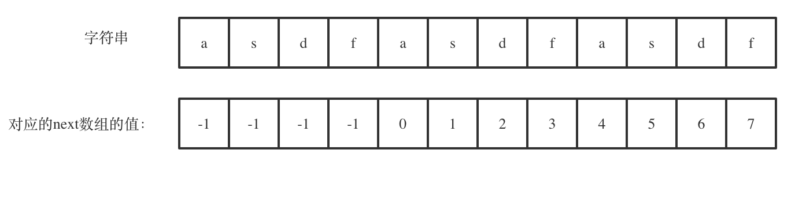

# 代码随想录学习笔记

## 数组

### 二分查找

>题目：给定一个`n`个元素有序的（升序）整型数组`nums`和一个目标值`target`，写一个函数搜索`nums`中的`target`，如果目标值存在返回下标，否则返回`-1`。

[力扣题目链接](https://leetcode.cn/problems/binary-search/description/)

#### 二分查找的使用思路
二分查找的使用前提首先是数组为**有序数组**，以及其中**没有重复元素**。因为一旦存在重复元素，使用二分查找后返回的下标可能不是唯一的。

#### 二分查找的第一种写法
定义target在一个左闭右闭的区间中，即[left,right]，所以：
- while (left <= right) 要使用 <= ，因为left == right是有意义的，所以使用 <=
- if (nums[middle] > target) right 要赋值为 middle - 1，因为当前这个nums[middle]一定不是target，那么接下来要查找的左区间结束下标位置就是 middle - 1

#### 二分查找的第二种写法
定义target在一个左闭右开的区间中，即[left,right)，则：
- while (left < right)，这里使用 < ,因为left == right在区间[left, right)是没有意义的
- if (nums[middle] > target) right 更新为 middle，因为当前nums[middle]不等于target，去左区间继续寻找，而寻找区间是左闭右开区间，所以right更新为middle，即：下一个查询区间不会去比较nums[middle]
```C++
int middle = left + ((right - left) / 2);//一般这样写可以防止溢出
if (nums[middle] > target) {
    right = middle; // target 在左区间，在[left, middle)中
    } else if (nums[middle] < target) {
    left = middle + 1; // target 在右区间，在[middle + 1, right)中
    }
```

### 长度最小的子数组

>题目：给定一个含有`n`个正整数的数组和一个正整数`target`。
找出该数组中满足其总和大于等于`target`的长度最小的子数组`[nums_l, nums_l+1, ..., nums_r-1, nums_r]`，并返回其长度。如果不存在符合条件的子数组，返回`0`。

[力扣题目链接](https://leetcode.cn/problems/minimum-size-subarray-sum/description/)

#### 滑动窗口
所谓滑动窗口，就是**不断的调节子序列的起始位置和终止位置，从而得出我们要想的结果**。

- 窗口内是什么？
  窗口就是满足**其和 ≥ s**的长度最小的连续子数组。
- 如何移动窗口的起始位置？
  窗口的起始位置如何移动：如果当前窗口的值大于等于s了，窗口就要向前移动了（也就是该缩小了）。
- 如何移动窗口的终止位置？
  窗口的结束位置如何移动：窗口的结束位置就是遍历数组的指针，也就是for循环里的索引。
```C++
while(sum >= s){
    subLength = (j - i + 1);
    result = result < subLength ? result : subLength;
    sum -= nums[i++];
}
```

## 链表

### 环形链表Ⅱ

>题目：给定一个链表，返回链表开始入环的第一个节点。 如果链表无环，则返回`null`。
为了表示给定链表中的环，使用整数`pos`来表示链表尾连接到链表中的位置（索引从 0 开始）。 如果`pos`是 -1，则在该链表中没有环。
说明：不允许修改给定的链表。

[力扣题目链接](https://leetcode.cn/problems/linked-list-cycle-ii/description/)

#### 判断链表中是否有环
快慢指针法：分别定义`fast`和`slow`指针，从头结点出发，`fast`指针每次移动两个节点，`slow`指针每次移动一个节点，**如果`fast`和`slow`指针在途中相遇 ，说明这个链表有环**。

#### 找到环的入口
有环的话快慢指针一定在环内相遇。现在设置另一个以头结点为起点的慢指针，以及之前的慢指针，让他们俩一起走“快慢指针相遇时慢指针走过的距离”。这样，旧慢指针走了原来两倍的路程，即快指针的路程，那么它会停在快指针停的地方。而新慢指针，它以相同的速度走了旧慢指针原本走过的路，也会停在原来快慢指针相遇的地方。这时候三个指针相遇。对于**两个慢指针，他们速度相同，又能在环内相遇，那么往前倒推，他们一定在环内一直相遇，直到退回至他们在环的入口处第一次相遇**，再退回时新慢指针即将第一次入环。所以两个慢指针第一次相遇时就是在环的入口处。


## 字符串

### 实现字符串内查找模型字符串（KMP算法）

> 题目：给你两个字符串`haystack`和`needle`，请你在`haystack`字符串中找出`needle`字符串的第一个匹配项的下标（下标从 0 开始）。如果`needle`不是`haystack`的一部分，则返回-1 。

[力扣题目链接](https://leetcode.cn/problems/find-the-index-of-the-first-occurrence-in-a-string/description/)

#### PMT（部分匹配表）
对于任意长度的字符串，都有数个前缀集合和后缀集合，**PMT中的值是字符串的前缀集合与后缀集合的交集中最长元素的长度**。
>如：对于‘aba’，它的前缀集合为{‘a’, ‘b’}，后缀 集合为{‘ba’, ‘a’}。两个集合的交集为{‘a’}，那么长度最长的元素就是字符串‘a’了，长度为1，所以对于‘aba’而言，它在PMT表中对应的值就是1。对于字符串‘ababa’，它的前缀集合为{‘a’, ‘ab’, ‘aba’, ‘abab’}，它的后缀集合为{‘baba’, ‘aba’, ‘ba’, ‘a’}，两个集合的交集为{‘a’, ‘aba’}，其中最长的元素为‘aba’，长度为3。

#### PMT对于字符串查找的帮助
主字符串中 i 指针之前的 PMT[j−1]位就一定与模式字符串的第0位至第PMT[j−1]位是相同的。这是因为主字符串在i位失配，也就意味着主字符串从 i−j 到 i 这一段是与模式字符串的 0 到 j 这一段是完全相同的。


>如图所示，在字符串“ababab”中，最大相等前后缀为‘abab’，故对应的PMT值即为4。当 j 指针移动到‘c’时，i 和 j 对应的值不再相等，故j需要寻找前一个元素所对应的PMT值，即为4，这意味着在‘ababab’中，前半部分的‘abab’和后半部分的‘abab’是等价的，不需要重新判别一次。故 j 指针可以直接回退到PMT值所对应的下标（在本例中是4）。

#### next数组
由于在第 j 位失配实际上需要的是第 j-1 位的PMT值，所以编程中不直接使用PMT数组，而是将其整体右移一位，第0位设置为-1，得到next数组。
**构建next数组的过程**：利用双指针法，比较慢指针s[j+1]与快指针s[i]，如果两者不等，则 j 需要回退：**j=next[j]**，若相等则两者同时前进，并把 j 赋给next[i]：**next[i]=j**。

#### 利用next数组匹配字符串
j从-1，i从0开始遍历，比较s[i]与t[j+1]，如果两者不等则j利用next数组回退：**j=next[j]**，若相等则同时向后移动。如果 j 指向了模式串 t 的末尾，那么就说明模式串 t 完全匹配文本串 s 里的某个子串了。

参考资料：(https://www.zhihu.com/question/21923021/answer/281346746)

### 重复的子字符串

> 题目：给定一个非空的字符串 s ，检查是否可以通过由它的一个子串重复多次构成。

[力扣题目链接](https://leetcode.cn/problems/repeated-substring-pattern/description/)

#### 移动匹配
一个由多个子串重复组成的字符串s，对于s+s，中间部分一定能够组成出一个新的字符串  s。相对地，如果中间能够组成出字符串`s`，则其一定是一个由多个子串重复组成的字符串。
为了防止在s+s中寻找到最初的两个s，需要对其进行“掐头去尾”：去掉该字符串中第一个和最后一个字符。之后在其中寻找s即可。（寻找过程本质上使用了KMP算法）

#### 使用KMP算法
结论1（充分性）：**如果一个字符串s是由重复子串组成，那么最长相等前后缀不包含的子串一定是字符串s的最小重复子串。**
结论2（必要性）：**当最长相等前后缀不包含的子串的长度可以被字符串s的长度整除，那么不包含的子串就是s的最小重复子串。**

如果`next[len-1] != -1`，则说明字符串存在最长相同的前后缀。
最长相等前后缀的长度为：`next[len-1] + 1`。
则字符串中最长相等前后缀不包含的子串的长度为`len - (next[len-1] + 1)`。
如果`len % (len - (next[len-1] + 1)) == 0`，则说明可以整除，字符串s是重复字符串。


>`next[len - 1] = 7`，`next[len - 1] + 1 = 8`，8就是此时字符串asdfasdfasdf的最长相同前后缀的长度。
>`(len - (next[len - 1] + 1))` 也就是：12(字符串的长度) - 8(最长公共前后缀的长度) = 4， 为最长相同前后缀不包含的子串长度
>4可以被 12(字符串的长度) 整除，所以说明有重复的子字符串（asdf）。